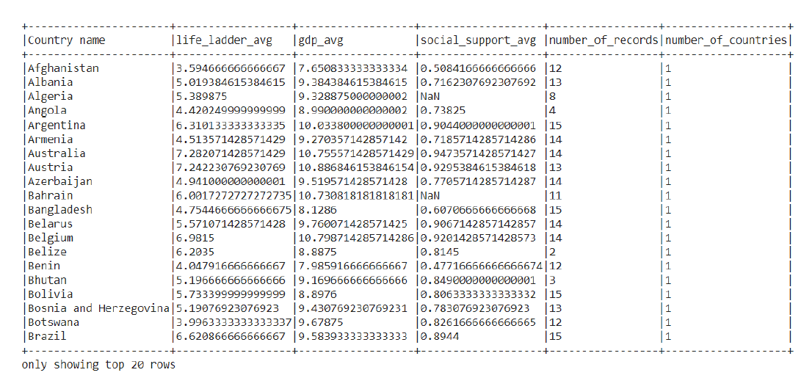
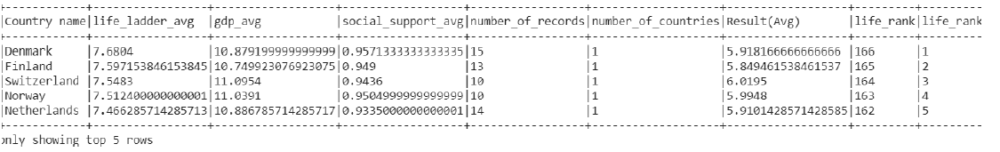
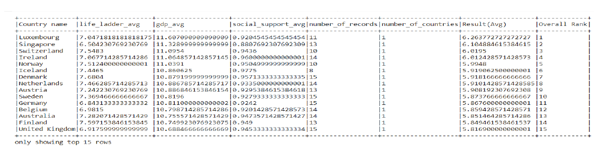
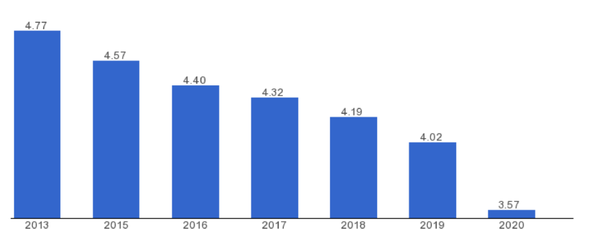

# Big-data-world-happiness-report

# Abstract
The project deals with analysis of the World Happiness Report using Spark. PySpark is
an interface for Apache Spark in Python. It not only allows you to write Spark
applications using Python APIs, but also provides the PySpark shell for interactively
analyzing your data in a distributed environment. PySpark supports most of Spark’s
features such as Spark SQL, DataFrame, Streaming, MLlib (Machine Learning) and
Spark Core. We used functions of PySpark like SparkContext, CreateDataFrame,
Aggregate, Sum, Collect, Count, CountDistinct, etc.

# Problem Statement
Given the World Happiness Report of all the countries of the last 15 years, we try to
give the countries a ranking based on their performance in the World Happiness Report
over the past 15 years, so that we can predict the best country to live based on all the
parameters. We also try to rank the countries based on many other criterias and try to
infer some key points from the dataset and conclude a few.

# Introduction
The World Happiness Report is a landmark survey of the state of global happiness .
The report continues to gain global recognition as governments, organizations and civil
society increasingly use happiness indicators to inform their policy-making decisions.
Leading experts across fields – economics, psychology, survey analysis, national
statistics, health, public policy and more – describe how measurements of well-being
can be used effectively to assess the progress of nations. The reports review the state
of happiness in the world today and show how the new science of happiness explains
personal and national variations in happiness. How can we measure something like
Happiness quantitatively, especially at a country level? So, a report is generated by the
United Nations Sustainable Development Solutions Network, known as the Word
Happiness Report. The report is based on 6 criterias, i.e., GDP per Capita, Healthy Life
Expectancy, Social Support, Freedom to make life choices, Generosity, Perception of
Corruption. A final score ranging from 0 to 8 is awarded to each country.

# Overview of the project
The Apache Spark is a lightning-fast cluster computing designed for fast computation. It
was built on top of Hadoop MapReduce and it extends the MapReduce model to
efficiently use more types of computations which includes Interactive Queries and
Stream Processing.

# Tools Used:
● Google Colab  
● Pyspark  
● Numpy  
● Pandas  

# Results

# References
● https://spark.apache.org/docs/latest/api/python/    
● https://spark.apache.org/     
● https://www.kaggle.com/ajaypalsinghlo/world-happiness-report-2021?select=world-happiness-report.csv    
● https://worldhappiness.report/ed/2021/    
● https://databricks.com/glossary/pyspark   
● https://realpython.com/pyspark-intro/   
